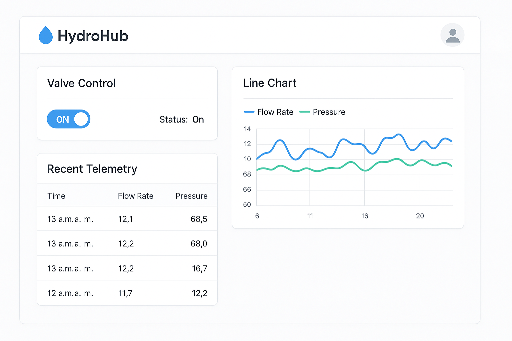

# HydroHub 💧  
A **miniature, production-style** full-stack demo that mimics a connected water-control platform.

* **Python device simulator** — publishes flow-rate & pressure via MQTT and listens for open/close commands.  
* **API server (Express + PostgreSQL)** — REST & WebSocket endpoints, JWT auth, MQTT ingestion.  
* **HTML/JS dashboard** — live charts, valve toggles, alert table.  
* **Docker-Compose infra** — Postgres + Mosquitto + hot-reloading API for one-command startup.

---

## 1. Quick Start ⏱️

```bash
# 1 Clone & enter repo
git clone https://github.com/LeeMarshall1113/HydroHub.git
cd HydroHub

# 2 Spin up services (Postgres, Mosquitto, API)
docker compose up -d

# 3 Start the Python simulator (publishes data for valve 1)
python simulator/simulator.py --broker localhost --valve 1

# 4 Open the dashboard
open http://localhost:3000/client/index.html
```

---

## 2. Architecture 🗺️

```text
              (MQTT)
          ┌─────────────┐              WebSocket(/ws)
          │ Python sim  │ ──────────▶ ┌──────────────┐
          │  (CLI)      │             │  API server  │ ─── REST(/api)
          └─────────────┘             │ Express.js   │
                                       │  Postgres    │
                                       └──────▲───────┘
                                              │
                                      SQL migrations (initDb)
```

* **Telemetry** – `valve/{id}/telemetry` → `{ flow, pressure }`  
* **State** – `valve/{id}/state` → `{ state: true|false }`  

---

## 3. Stack 🛠️

| Layer        | Tech & Libs                                                                               |
|--------------|-------------------------------------------------------------------------------------------|
| Simulator    | Python 3 · paho-mqtt                                                                      |
| Transport    | MQTT (Mosquitto 2) · WebSocket (`ws` 8.x)                                                 |
| Backend      | Node 20 · Express 4 · `pg` 8 · `jsonwebtoken` 9 · `bcrypt` 5                              |
| Database     | PostgreSQL 16                                                                             |
| Front-end    | Vanilla HTML/JS (swap for React/Tailwind if desired)                                      |
| DevOps       | Docker Compose 3.8 · nodemon · GitHub Actions template                                    |

---

## 4. Endpoints 🔌

| Method | URL                       | Purpose                              |
|--------|---------------------------|--------------------------------------|
| POST   | `/api/auth/register`      | `{ email, password }` → 201          |
| POST   | `/api/auth/login`         | `{ email, password }` → `{ token }`  |
| GET    | `/api/valves`             | List valves                          |
| POST   | `/api/valves`             | `{ name }` → create valve            |
| POST   | `/api/valves/:id/toggle`  | Toggle open/close                    |
| WS     | `/ws`                     | Pushes `telemetry` & `state` events  |

---

5. Screenshots 🖼️
<p align="center">  </p>


## 6. Local Dev Tips 💡

* **Hot-reload API** – `docker compose exec server npm run dev`  
* **PG shell** – `docker compose exec postgres psql -U hydro hydrohub`  
* **Add new valve quickly**

```sql
INSERT INTO valves(name, state) VALUES ('Main Line', false);
```

---

## 7. Roadmap / Stretch Goals 🚀

* React + Tailwind front-end  
* Role-based ACL (`operator` / `admin`)  
* Alert thresholds & push notifications  
* PWA offline mode  
* Terraform deploy to Azure / AWS  

---

## 8. License

MIT — see `LICENSE`.
